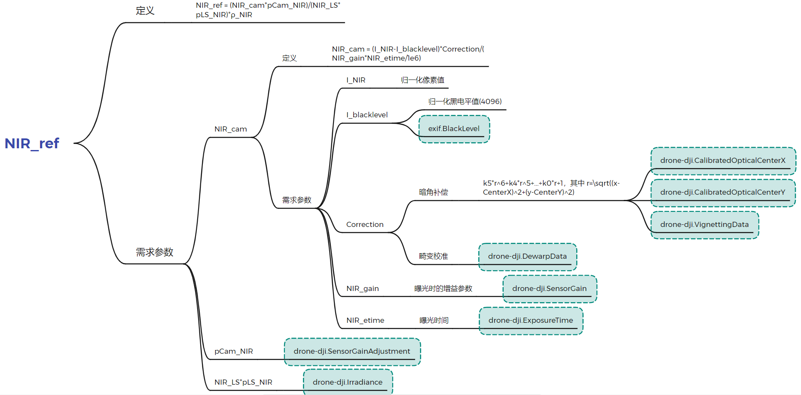

# tiff工程
## 数据集
AQ600和DJI M3M数据分别存储在相应文件夹下
## py文件介绍
- main_1.py：多个但波段图像组合成为一个多波段文件
- main_2.py：多波段文件按波段分离
- main_3.py：利用gdal库打开tif文件并读取简单参数（波段数、投影信息等）
- visualize_1.py：单波段图像可视化
- exifread_exifread.py：利用exifread库读取EXIF元信息（DJI图像信息读取不全）
- exifread_pyexif.py：利用pyexif库读取EXIF元信息（需要安装什么东西，但有FOV数据）
- exifread_pyexiv2.py：利用pyexiv2库读取EXIF元信息（缺少FOV数据）
- Radiometric_calibrations.py：参照 [P4M图像处理手册](Attachments/P4M图像处理指南.pdf) 进行辐射定标 